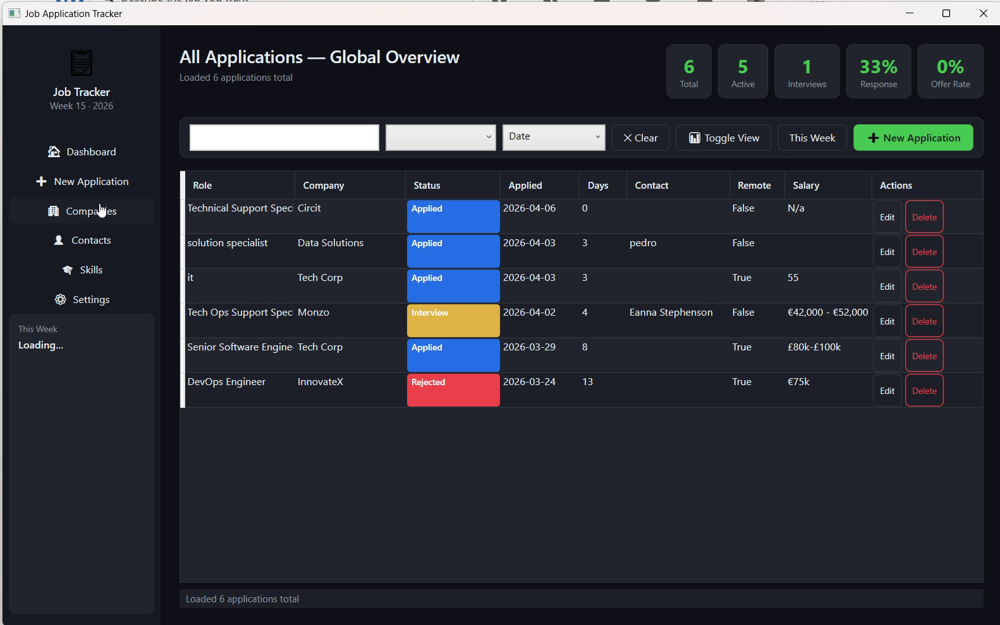
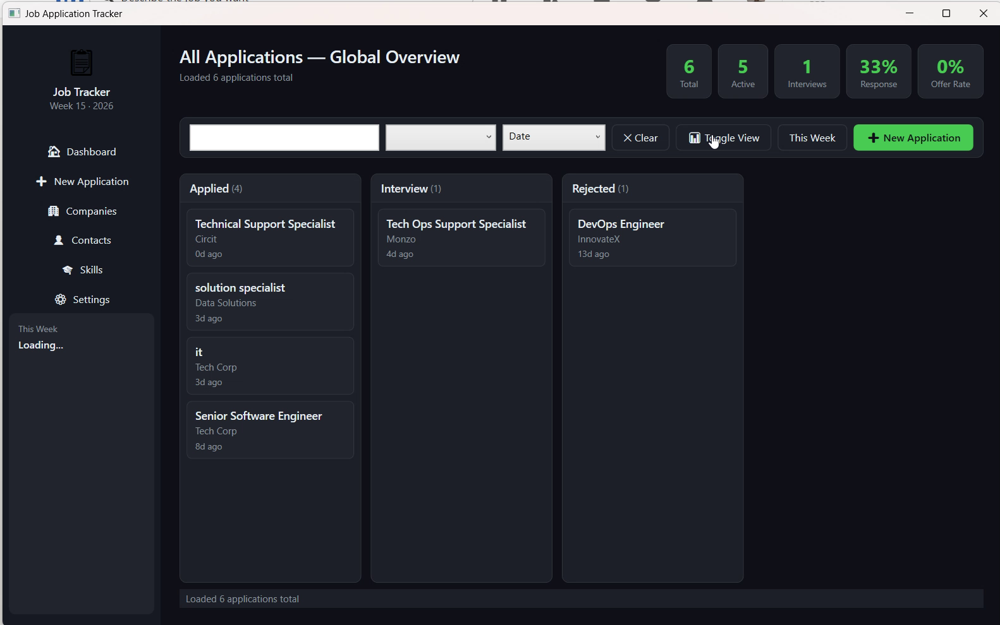
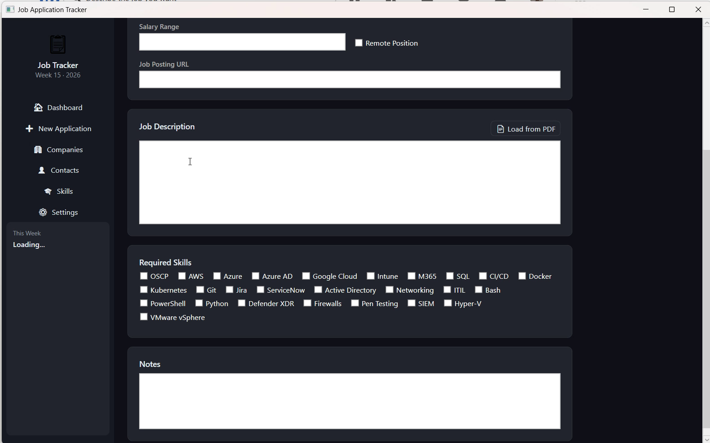

# Job Application Tracker


[](https://juandresrodca.github.io/job-application-tracker/)
[](https://github.com/sponsors/juandresrodca)

A production-quality .NET 8 WPF desktop application for tracking job applications with Obsidian vault sync.

> **Beta v0.1.0** — fully functional with Companies, Contacts, Skills management, Kanban board view, PDF extraction, email import, Obsidian sync, and a full test suite.

---

## Screenshots

### Dashboard — Table View
Track all your job applications at a glance with sortable columns and real-time status updates.



### Dashboard — Kanban Board
Organize your applications by status with an intuitive drag-and-drop Kanban workflow.



### Application Form
Comprehensive job application form with PDF extraction, skill tracking, and company/contact management.



---

## Features (v0.1.0)

- **Companies / Contacts / Skills** — full CRUD pages with inline edit panels
- **Dashboard views** — table and Kanban board toggle
- **Application tracking** — full job application lifecycle from Applied → Interview → Offer/Rejected
- **Obsidian vault sync** — auto-sync to markdown files in your vault with protected user notes section
- **PDF extraction** — extract text and company name from job posting PDFs
- **Email import** — paste a confirmation email to auto-fill role, company, date, and URL
- **Stat cards** — application count, response rate, and offer rate at a glance
- **Dark theme** — full dark mode support with custom resource dictionary
- **Delete confirmations** — prevent accidental data loss
- **xUnit test suite** — service, settings, and in-memory repository tests

---

## Architecture Decision: Why MVVM + WPF?

**MVVM over MVC for WPF** because:
- WPF's data binding engine is built for MVVM — `{Binding}` targets `INotifyPropertyChanged`
- ViewModels are fully testable without UI (no Window/Page references)
- Commands (`ICommand`) replace controller actions cleanly
- MVC would fight the WPF binding system, not work with it

**Clean Architecture layers:**
```
JobTracker.WPF          → Presentation (XAML, ViewModels, Converters)
JobTracker.Application  → Use Cases (Services, DTOs, Interfaces)
JobTracker.Domain       → Entities, Enums, Repository Contracts
JobTracker.Infrastructure → SQLite + Dapper, Markdown Sync, PDF Extraction
```

**Data flow:**
```
UI (XAML binding) ←→ ViewModel ←→ Application Service ←→ Repository (Dapper/SQLite)
                                                      ↘ MarkdownSyncService  → .md files
                                                      ↘ PdfExtractionService → Job PDFs
                                                      ↘ EmailExtractionService → raw email text
```

---

## Project Structure

```
JobTracker/
├── JobTracker.sln
└── src/
    ├── JobTracker.Domain/
    │   ├── Entities/
    │   │   ├── JobApplication.cs       # Core entity, computed MarkdownFileName
    │   │   ├── Company.cs
    │   │   ├── Contact.cs
    │   │   └── Skill.cs                # + ApplicationSkill join entity
    │   ├── Enums/
    │   │   └── ApplicationStatus.cs    # Applied → Screening → Interview → Offer/Rejected
    │   └── Interfaces/
    │       └── IRepositories.cs        # Contracts: IJobApplicationRepository, etc.
    │
    ├── JobTracker.Application/
    │   ├── DTOs/
    │   │   └── Dtos.cs                 # Records: JobApplicationDto, CreateRequest
    │   ├── Interfaces/
    │   │   └── IServices.cs            # IJobApplicationService, IMarkdownSyncService, IPdfExtractionService, IEmailExtractionService
    │   └── Services/
    │       ├── JobApplicationService.cs
    │       └── SettingsService.cs      # JSON-persisted settings in %APPDATA%\JobTracker
    │
    ├── JobTracker.Infrastructure/
    │   ├── Data/
    │   │   └── DatabaseContext.cs      # SQLite + WAL mode + schema init
    │   ├── Repositories/
    │   │   ├── JobApplicationRepository.cs   # Dapper multi-map joins
    │   │   └── OtherRepositories.cs          # Company, Contact, Skill
    │   ├── Markdown/
    │   │   └── MarkdownSyncService.cs  # Section-aware merge (never overwrites user notes)
    │   ├── Pdf/
    │   │   └── PdfExtractionService.cs  # Extract text and metadata from job posting PDFs
    │   └── Email/
    │       └── EmailExtractionService.cs # Parse pasted email text → role, company, date, URL
    │
    └── JobTracker.WPF/
        ├── App.xaml / App.xaml.cs      # DI container + DB init + skill seeding
        ├── ViewModels/
        │   ├── ViewModelBase.cs        # INPC, RelayCommand, AsyncRelayCommand
        │   ├── DashboardViewModel.cs   # Week stats, filter/sort, CRUD commands
        │   ├── ApplicationFormViewModel.cs  # Add/Edit form + PDF extraction + email import
        │   └── SettingsViewModel.cs    # Vault path, general app settings
        ├── Views/
        │   ├── MainWindow.xaml(.cs)    # Shell: sidebar nav + Frame
        │   └── Pages/
        │       ├── DashboardPage.xaml(.cs)
        │       ├── ApplicationFormPage.xaml(.cs)
        │       └── SettingsPage.xaml(.cs)
        ├── Converters/
        │   └── ValueConverters.cs      # Status→Color, Bool→Visibility, Days→Urgency
        └── Themes/
            └── Dark.xaml               # Full dark theme resource dictionary
```

---

## Prerequisites

| Tool | Version | Download |
|------|---------|----------|
| .NET SDK | 8.0+ | https://dot.net |
| Visual Studio | 2022 17.8+ | Community (free) |
| *or* VS Code | any | + C# Dev Kit extension |
| Windows | 10/11 | WPF is Windows-only |

---

## Quick Start

### 1. Clone and open

```bash
git clone <your-repo>
cd JobTracker
```

Open `JobTracker.sln` in Visual Studio 2022, or:

```bash
cd src/JobTracker.WPF
dotnet run
```

### 2. First run

The app auto-creates:
- `%APPDATA%\JobTracker\jobtracker.db`  — SQLite database
- `%APPDATA%\JobTracker\settings.json` — your preferences
- 26 default IT/security skills pre-seeded

### 3. Configure Obsidian vault sync (optional)

Go to **Settings → Browse** and select your vault folder. See the [full setup guide](#obsidian-vault-sync) below.

---

## Obsidian Vault Sync

Sync automatically writes a structured markdown file for every job application into your Obsidian vault. Notes you write inside the file are never overwritten.

> **Obsidian does not need to be open** — the app writes files directly to the vault folder on disk. Obsidian picks them up the next time it refreshes.

### Setup

**1. Open the Settings page**
Click **Settings** in the left sidebar (or press `Ctrl+O`).

**2. Set your vault path**
Click **Browse** next to the *Obsidian Vault Path* field and select the root folder of your vault — the folder that contains your `.obsidian/` directory.

> If you don't have an Obsidian vault yet, create any empty folder and point the app at it. Open that folder as a vault in Obsidian afterwards.

**3. Save**
Click **Save Settings**. The path is stored in `%APPDATA%\JobTracker\settings.json`.

**4. Trigger a sync**
Save or update any application. A markdown file is written immediately to your vault. A status-bar message confirms success (or shows an error if the path is unreachable).

---

### Where files are created

Files are written to the vault root with this naming pattern:

```
<vault>/<YYYY-MM-DD>_<Company>_<Role>.md
```

Example:
```
C:\MyVault\2025-04-02_KPMG-Ireland_IT-Infrastructure-Specialist.md
```

---

### Preserving your notes

Each file contains a `## User Notes` section bounded by HTML comment markers:

```markdown
## User Notes
<!-- USER_NOTES_START -->
Your notes here — write anything.
<!-- USER_NOTES_END -->
```

**Everything inside those markers is yours.** Re-syncing the application (e.g. after a status change) updates the frontmatter and structured fields but leaves your notes untouched.

---

### Tips

- The vault folder just needs to **exist on disk** — no Obsidian plugins or configuration required.
- Works alongside your existing vault notes; files are added without touching anything else.
- If the vault path is not set or the folder is unreachable, the app continues working normally — sync errors appear in the status bar and are never silent.
- To stop syncing, clear the vault path in Settings and save.

---

## Email Import

When you apply to a job, most platforms (LinkedIn, Indeed, Greenhouse, Workday, company ATS) send a confirmation email. Instead of typing everything manually, paste that email directly into the app and let it extract the key fields for you.

### How to use

**1. Open the New Application form**
Click **+ New Application** on the dashboard.

**2. Click "✉ Import from Email"**
The button sits in the Job Description section, next to "📄 Load from PDF".

**3. Paste the email**
Copy the full email from your mail client (subject line + body) and paste it into the text area.

**4. Click "Extract & Fill"**
The app parses the text and pre-fills:

| Field | Extracted from |
|---|---|
| Role Name | Subject line or body patterns ("application for `<Role>` at…") |
| Company | Sender display name, "thank you for applying to `<Company>`", or `Company:` label |
| Applied Date | `Date:` email header, ISO dates, or long-form dates in the body |
| Job Posting URL | Any job/careers URL found in the body |
| Job Description | The full pasted email text |

**5. Review and save**
An alert confirms what was extracted. Correct any fields the parser got wrong, then click **Save**.

> If the company name is not already in your database, the app asks whether to create it on the spot — no need to switch pages.

### What it handles

The extractor covers the most common confirmation email formats:
- **LinkedIn** — "Your application was sent to `<Company>`"
- **Greenhouse / Lever** — "We've received your application for `<Role>`"
- **Workday** — "Thank you for applying to `<Company>` for the position of `<Role>`"
- **Generic ATS** — `Position:` / `Job Title:` label lines, `From:` display name

Unrecognised formats still work partially — at minimum the body text is loaded as the job description and the date defaults to today.

---

## Database Schema

```sql
Companies       (Id, Name, Website, Industry, Location, Notes)
Contacts        (Id, Name, Email, Phone, LinkedInUrl, Role, Notes, CompanyId)
Skills          (Id, Name, Category)
JobApplications (Id, RoleName, JobDescription, Status, AppliedDate, LastUpdated,
                 JobPostingUrl, SalaryRange, IsRemote, Notes, CvSnapshotText,
                 CompanyId FK, ContactId FK)
ApplicationSkills (JobApplicationId FK, SkillId FK, IsOwned, IsRequired)
```

**Indexes:** AppliedDate, Status, CompanyId — the three most-filtered columns.

---

## Obsidian Markdown Format

```markdown
---
tags: [job-application, applied, 2025]
status: Applied
company: "KPMG Ireland"
role: "IT Infrastructure Specialist"
applied_date: 2025-04-02
contact: "Sharon Griffin"
remote: false
---

# Job Application — IT Infrastructure Specialist

## Company
**KPMG Ireland**

## Status
> **Applied**

## Timeline
| Field              | Value      |
|--------------------|------------|
| Applied Date       | 2025-04-02 |
| Days Since Applied | 3          |

## Contact
- **Name:** Sharon Griffin
- **LinkedIn:** [Profile](https://linkedin.com/...)

## Skills Required
- Azure ✅
- PowerShell ✅
- SIEM
- Defender XDR

## User Notes
<!-- USER_NOTES_START -->
_
<!-- USER_NOTES_END -->
```

The `USER_NOTES_START/END` markers protect your manual notes from being overwritten on every sync.

---

## Extending the Application

### Add automated email polling
The current email import is paste-based. To fully automate it:
- Add OAuth token storage (DPAPI-encrypted) in `SettingsService`
- Implement a Gmail/Outlook REST client in Infrastructure
- Add a background poller that scans the inbox for confirmation patterns and creates draft applications

### Add interview scheduling
- Add a calendar/timeline view in WPF
- Add an `Interview` entity to track dates, times, and interviewer details
- Display interviews on the Dashboard with urgency indicators

### Add cloud sync
- Add `ICloudSyncService` in Application.Interfaces
- Implement with Azure Blob Storage or Dropbox API
- Trigger after every local DB write for real-time sync across devices

### Add CV improvements AI analysis
- Add `IAiService` in Application.Interfaces
- Implement with OpenRouter or Ollama in Infrastructure
- Add DPAPI-encrypted API key storage in SettingsService
- Trigger from ApplicationFormViewModel with job description and CV text

---

## Known Limitations / TODOs

- [ ] CSV / Excel export for applications
- [ ] Calendar / timeline view for interview scheduling
- [ ] Automated email polling (OAuth-based inbox scan to replace manual paste)
- [ ] Cloud sync (Dropbox / Azure Blob) for multi-device support
- [ ] AI-powered CV improvement suggestions (requires API integration)
- [ ] Toast/snackbar notifications (currently uses status bar)
- [ ] ViewModel unit tests require `net8.0-windows` test project (WPF dependency)

---

## Installing the Beta

Download `JobTracker.exe` from the [GitHub Releases](https://github.com/juandresrodca/job-application-tracker/releases) page and run it — no installer needed.

**Windows SmartScreen warning:** Because the EXE is unsigned during beta, Windows will show a *"Windows protected your PC"* prompt on first run. Click **"More info"** then **"Run anyway"** to proceed. This is expected for unsigned executables; code signing is planned for v1.0.

---

## License
MIT — use freely, adapt to your own tracker, whatever you need.
